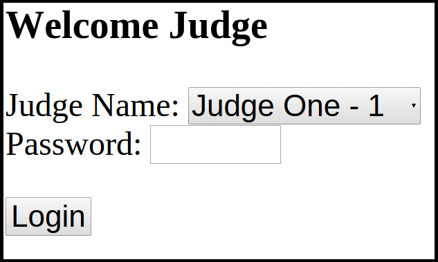

# What is the Judge application

The judge application allows a set of judges to pass judgement on a set of science fair projects.    The application
is used to assign and direct a judge to a project.  The application then collects the scores that the judge makes.
The application was written to judge grades K through 4.
Each judge is assigned a single grade to assess.

The judge application is configured with a set of judges (name and grade assigned) and a set of projects.  The application
randomly assigns the judge to a project when the judge asks to start. They then input their judgement for an assigned
project.   They then repeat until all projects in their grade have been judged three times.

The judge application also has an administrator interface.   This interfaces allows the science fair staff to "check
students in" and monitor the progress of the science fair.  It also provides
a page which shows the highest 5 scores for each grade.

## What Does a Judge Do?

A judge uses an ipad/iphone/android/tablet to connect to the application.  The judge then finds their name and the grade
the are assigned to on a dropdown.   The judge then enters the password and clicks login.

The judge see sees the begin screen.    This screen confirms their identity, and shows them how many projects they
   have judged and shows them how many more they could possibly judge.   For example if 3rd grade had 20 students and
   two of them were already judged by this judge, then 17 possible students remain.

... add image of being screen ...

A judge uses the application to request a project to judge.   The judge is then assigned a project and asked to judge it.
The screen includes a bunch of things they should ensure the project has (the checkboxes), 4 subjective scores and
lastly a multiplier.

... show image of judgements

After the judge makes their choices they submit them.   They are then shown a summary screen,

    .... image of summary screen

When the user confirms the score, then they are returned to the beginning screen.

## What Does the Admin Do?

### Loading Students and Judges

### Doing Check-In

### Using the app to Monitor the Progress

### Awards page
